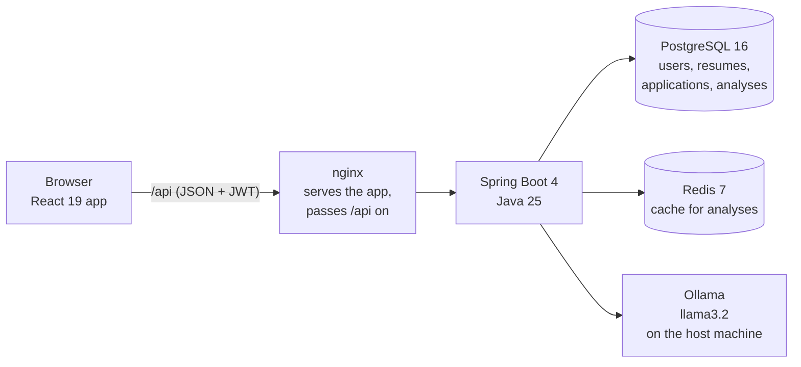

# Job Assistant

**Know where you stand before you apply.** Job Assistant compares your resume with a job posting on a local AI model, shows the skills you have and the ones you are missing, drafts the cover letter, and keeps every application in one place.

[](https://github.com/Jatin1Mathur/job-application-assistant/actions/workflows/ci.yml)


[](LICENSE)


## Contents

- [Why I built this](#why-i-built-this)
- [Key features](#key-features)
- [Screenshots](#screenshots)
- [Architecture](#architecture)
- [Tech stack](#tech-stack)
- [Quick start (Docker)](#quick-start-docker)
- [Development setup](#development-setup)
- [Demo account](#demo-account)
- [Testing](#testing)
- [Engineering highlights](#engineering-highlights)
- [Project structure](#project-structure)
- [Design](#design)
- [Documentation](#documentation)
- [How I built it](#how-i-built-it)
- [What I learned](#what-i-learned)
- [Roadmap](#roadmap)
- [Author](#author) and [License](#license)

## Why I built this

I am an M.Sc. Software Engineering student, and I apply to many jobs at the same time. Before sending an application I wanted an honest answer to one question: how well does my resume fit this posting, and what is missing? I built Job Assistant to answer that first and to keep every application, resume and cover letter in one place. It was also my chance to build one complete product from the database to the deployment, with an AI model that runs on my own machine instead of a cloud service.

## Key features

- **AI on your own machine.** A match score from 0 to 100 with matching skills, missing skills and three tips; a cover letter drafted only from facts in the resume, in three tones, with regenerate and PDF export. Repeated analyses come from a Redis cache.
- **Job tracking.** A card list or a Kanban board with drag and drop, a status timeline, notes and interview dates, resume previews with the skills found in the text, and a command palette with keyboard shortcuts.
- **Insights from real data.** Interview rate, average match, next actions, a funnel from saved to offer, match score over time, skills by category and the best resume. A value that cannot be calculated yet is replaced by a sentence, not by 0.
- **Design and 3D.** An original design system ([DESIGN.md](DESIGN.md)) with light and dark mode, a 3D backpack and scroll story on the landing page, a compass on the login page, and flat fallbacks for reduced motion and for browsers without WebGL.

## Screenshots

| Dashboard: numbers with their trend, next actions, activity | Analysis: match score, matching and missing skills, tips |
|---|---|
|  |  |
| **Insights**: funnel, best resume, score over time, skills by category | **Board**: drag and drop between statuses, days in each stage |
|  |  |

The screenshots show the demo account, which contains made-up sample data.

## Architecture



The browser only talks to nginx, which serves the React app and passes every `/api` call on to the Spring Boot backend. The backend checks the login token (an httpOnly cookie) on each request, keeps all data in PostgreSQL, and asks a local language model (Ollama) for the match analysis and the cover letter. Finished analyses are remembered in Redis for 24 hours, so the same question is not sent to the slow model twice. Every row belongs to one user, and resume text is not sent to a cloud AI service.

The details are in **[docs/ARCHITECTURE.md](docs/ARCHITECTURE.md)**: container and layer diagrams, sequence diagrams for login and for the cache, the database model, the full API reference, security, testing and deployment. The reasons behind the main decisions are in the [decision records](docs/adr/).

## Tech stack

| Area | Technology |
|---|---|
| Frontend | React 19, TypeScript 6, Vite 8, Tailwind CSS 4, shadcn/ui, Motion, Recharts, dnd-kit, three.js with React Three Fiber, pdf.js |
| Backend | Java 25, Spring Boot 4.1, Spring Security (OAuth2 resource server, JWT in an httpOnly cookie, CSRF, BCrypt), Bucket4j rate limiting, Spring Data JPA, Bean Validation, PDFBox 3 |
| Data | PostgreSQL 16 with Flyway migrations, Redis 7 |
| AI | Ollama with `llama3.2`, called over HTTP (JSON mode for the analysis) |
| DevOps | Docker (multi-stage images, non-root), Docker Compose with health checks, nginx, GitHub Actions |
| Testing | JUnit 5, Mockito, Spring MockMvc, Testcontainers (PostgreSQL and Redis), Playwright browser tests, oxlint |

## Quick start (Docker)

You need Docker (Docker Desktop on a Mac) and Ollama with the `llama3.2` model. Ollama runs on your own machine, not in Docker; it is only needed for the AI requests.

1. Copy `.env.example` to `.env` and set your own values (only the first time).
2. Start everything with one command, from the project folder:
   ```
   docker compose up --build
   ```
3. Open http://localhost:3000 in your browser.

Stop it with `Ctrl+C`, or with `docker compose down` from a second terminal. Your data stays in a Docker volume and is there again at the next start. Add `-d` (`docker compose up --build -d`) to run it in the background.

What the command starts:

| Container | Address | What it is |
|---|---|---|
| frontend | http://localhost:3000 | nginx with the built React app; passes every `/api` call on to the backend |
| backend | http://localhost:8080 | Spring Boot (for Postman) |
| postgres | localhost:5432 | Database |
| redis | localhost:6380 | Cache |

The backend starts only after the database and the cache answer their health checks, and the frontend starts only after the backend is healthy. The backend reaches Ollama on your machine through `host.docker.internal`.

### How the images are built (multi-stage build)

Both `Dockerfile`s have two stages. The first stage has all the tools needed to build: the JDK and Maven for the backend, Node.js for the frontend. The second stage starts from a small image and copies in only the finished result: the jar file, or the built HTML, CSS and JavaScript files. The tools and the source code stay behind in the first stage and are not part of the image that runs. That makes the final images small (backend: 448 MB instead of the 1.09 GB of its build stage; frontend: 87 MB instead of 1.34 GB) and leaves less inside them that could be attacked. Both run as a normal user, not as root.

## Development setup

For working on the code it is quicker to run the backend and the frontend directly, so changes show up at once. Docker then only runs the database and the cache.

1. Start the database and the cache:
   ```
   docker compose up -d postgres redis
   ```
2. Start the backend (http://localhost:8080):
   ```
   ./mvnw spring-boot:run
   ```
3. In a second terminal, start the frontend:
   ```
   cd frontend
   npm install   # only the first time
   npm run dev
   ```
4. Open http://localhost:5173 in your browser.

If the whole app is already running in Docker, stop its backend and frontend first (`docker compose stop backend frontend`), because the backend uses the same port 8080.

The frontend is a React + Vite + TypeScript app with Tailwind CSS in the `frontend` folder. It uses shadcn/ui components, Motion for animations, lucide icons and sonner toasts, and has a light and a dark mode. It needs Node.js 20.19 or newer. The dev server passes every `/api` call on to the backend on port 8080 (see `frontend/vite.config.ts`), so the backend needs no CORS settings.

## Demo account

1. Start the app (see [Quick start](#quick-start-docker)) and open http://localhost:3000/login.
2. Click **Try with demo account**. No email and no password are needed.

You are then inside a shared account with two sample resumes, eight sample applications with a status history, notes and an interview date, and seven sample analyses. A few things to know:

- The sample analyses were written in advance, not produced by the app's AI model, and are labelled "sample data (not an AI result)". New analyses you start there are real AI results.
- The sample data is put back when the backend starts and every night at 03:00, so nothing you change is kept.
- The account has no password that anyone knows, and the database refuses to delete it or to change its email or password.
- On the landing page there is also a small "Try it now" demo that needs no account at all. It uses prepared sample results and says so.

## Testing

| Level | What | How to run |
|---|---|---|
| Backend | 240 tests (JUnit 5, Mockito, MockMvc): 150 unit tests, 83 web layer tests, 7 integration tests against a real PostgreSQL and Redis started by Testcontainers | `./mvnw test` (needs Docker running, nothing else) |
| Browser | 24 Playwright tests with 158 checks that use the running app like a user would | see below |
| Frontend | Lint and a build that includes the TypeScript check | `cd frontend && npm run lint && npm run build` |

Run the browser tests against the running app:

```
cd e2e
npm install                        # only the first time
npx playwright install chromium    # only the first time
npm test
```

To run them without Ollama, start the app with a stand-in for the AI model first: `docker compose -f docker-compose.yml -f e2e/docker-compose.e2e.yml up --build -d`. [e2e/README.md](e2e/README.md) explains both ways, what the stand-in replaces and what it does not.

### Continuous integration

On every push and every pull request, GitHub Actions runs `.github/workflows/ci.yml` on a fresh machine:

- **Backend tests**; Testcontainers starts a real PostgreSQL and Redis for the integration tests
- **Frontend build and lint**
- **Docker images**: builds both images, to prove the Dockerfiles work
- **Browser tests** (pull requests only): starts the whole app with Docker Compose and runs the Playwright suite. There is no AI model in CI, so only the language model is replaced by a stand-in with fixed answers.

The badge at the top of this file shows the result for `main`.

## Engineering highlights

- **240 backend tests** run on every push in CI. The integration tests start their own PostgreSQL and Redis with Testcontainers and cover the demo account and its database trigger.
- **158 browser checks in 24 Playwright tests** ([e2e/](e2e/)) cover the whole flow: sign-up, upload, AI analysis, cover letter, drag and drop, keyboard use, reduced motion, phone width and the demo account. CI runs them on every pull request against the same Docker setup as on a developer's machine. In CI only the language model is replaced by a stand-in with fixed answers, because there is no AI model there; the same suite also runs against the real model locally.
- **Cache speed-up:** in one measured run with `llama3.2`, the first analysis took 3.66 s and the same request again took 0.01 s from Redis (`X-Cache: MISS`, then `HIT`).
- **Contrast is computed, not guessed:** all 46 colour pairs used for text and controls were checked. Text pairs pass 4.5:1, control borders and focus rings pass 3:1, in light and dark mode.
- **3D that stays fast:** the 3D code (about 909 kB) is downloaded only on pages that show a scene, the pixel ratio is capped at 1.5 (1.25 on phones), rendering stops when a scene is off-screen or the tab is hidden, and phones get a lighter backpack (6,888 instead of 11,656 triangles). The scroll story holds about 60 frames per second on a MacBook Air (M4).
- **Three bugs that only Docker showed**, all found by running the full flow against the containers and all fixed:
  - nginx served the pdf.js worker (`.mjs`) as an unknown file type, so resume previews stayed empty.
  - The frontend health check asked `localhost`, which resolved to an address nginx did not listen on, so a working container was reported as unhealthy.
  - After a backend restart, nginx kept sending requests to the backend's old address and answered "502 Bad Gateway".
- **Small images:** 448 MB for the backend and 87 MB for the frontend, because the build tools stay in the first stage.
- **Login hardening:** the login token is in an httpOnly, SameSite cookie that JavaScript cannot read, changing requests need a CSRF token, and login attempts and AI requests are rate limited with a clear 429 answer ([ADR 007](docs/adr/007-login-token-in-an-httponly-cookie.md)).
- **A smaller first download:** every page is loaded on its own. The main bundle went from 1,213 kB to 426 kB (370 kB to 135 kB compressed).
- **Security basics:** passwords are stored as BCrypt hashes, secrets come from `.env`, the login error does not reveal whether an email exists, and both containers run as a normal user.

## Project structure

```
.
├── src/main/java/…/jobassistant   Backend: controller, service, repository, entity, dto, security, config
├── src/main/resources             application.yml and the Flyway migrations (db/migration, V1 to V6)
├── src/test                       Backend tests
├── frontend/                      React app: pages, components, the API client, 3D scenes; its Dockerfile and nginx config
├── e2e/                           Playwright browser tests and the stand-in for the AI model
├── docs/                          ARCHITECTURE.md, decision records (adr/), design decisions, screenshots
├── postman/                       Postman collection for the API
├── .github/workflows/             CI pipeline
├── Dockerfile                     Backend image (multi-stage)
├── docker-compose.yml             Starts everything with one command
├── DESIGN.md                      The design system
└── .env.example                   The settings to copy into .env
```

## Design

The design system is written down in [DESIGN.md](DESIGN.md): colours, typography, spacing, components, and do's and don'ts. [docs/design-decisions.md](docs/design-decisions.md) explains the audit, every change with its UX reason, the trade-offs, and what has not been done.

The dashboard list before and after the redesign:

| Before | After |
|---|---|
|  |  |

More before and after pictures of every page, in desktop and phone size and in light and dark mode, are in [docs/screenshots](docs/screenshots). They are WebP files, which keeps the repository small.

## Documentation

| Document | What is in it |
|---|---|
| [docs/ARCHITECTURE.md](docs/ARCHITECTURE.md) | Diagrams of the system, the backend layers, login and caching, the database, the API reference, security, testing, CI and deployment |
| [docs/adr/](docs/adr/) | Seven short decision records: local AI, Redis cache, JWT, Flyway, 3D on selected pages, Docker Compose, the login cookie |
| [DESIGN.md](DESIGN.md) | The design system |
| [docs/design-decisions.md](docs/design-decisions.md) | The design audit, every change with its UX reason, trade-offs |
| [e2e/README.md](e2e/README.md) | How to run the browser tests |
| [postman/README.md](postman/README.md) | How to use the Postman collection |

## How I built it

I built this project step by step, with [Claude Code](https://claude.com/claude-code) as an AI pair programmer. To be clear about who did what:

- **My part:** I planned each step and wrote down what it should do. I reviewed every pull request before merging it, tested the features myself in the running app, and made the product and design decisions: what the app should do, what it should look like, and what to leave out.
- **Claude Code's part:** it wrote most of the code, the tests and the first drafts of the documentation from my instructions, ran the tests, and opened the pull requests. Where it made a choice of its own, it said so in the pull request, and I decided whether to keep it.

Each step is one pull request, so the history shows how the project grew: database and resume upload, the job tracker, the AI analysis and cover letter, validation and caching, login with JWT, the React frontend, the design system, the 3D scenes, and Docker with continuous integration.

## What I learned

- **"It works on my machine" is not the end.** Two bugs appeared only when the app ran in Docker. Running the whole flow against the real setup found them before anyone else did.
- **Tests need the real thing sometimes.** Mocks are fast, but the rule that the demo user cannot be deleted lives in the database, so it is tested against a real PostgreSQL.
- **Good design is mostly saying no.** One accent colour, few type styles and written rules made the app calmer than any added effect did.
- **An AI pair programmer is fast, but the judgement stays with me.** Clear step descriptions, small pull requests and reading every change mattered more than the speed of writing code.
- **Honesty is a feature.** Sample data is labelled, numbers that cannot be calculated are not shown as 0, and the cover letter prompt forbids inventing experience. A small local model still makes mistakes, so the app tells users to check its output.

## Roadmap

- Cloud deployment with a hosted AI model, so the app can be tried without installing anything
- Email reminders for follow-ups and interviews
- A browser extension that imports a job posting from the page you are reading

## Author

**Jatin Mathur**, M.Sc. Software Engineering student

- GitHub: [Jatin1Mathur](https://github.com/Jatin1Mathur)
- LinkedIn: [jatin-mathur-b04b122b](https://www.linkedin.com/in/jatin-mathur-b04b122b)

## License

[MIT](LICENSE)
