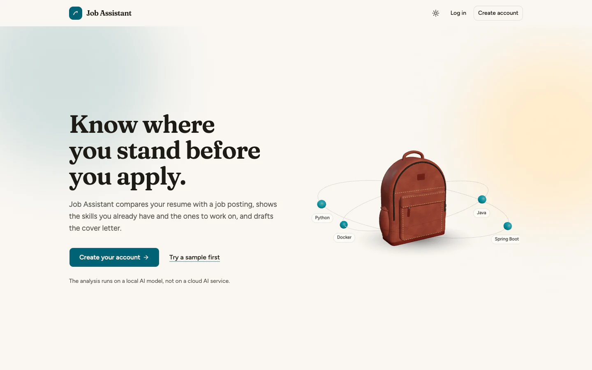
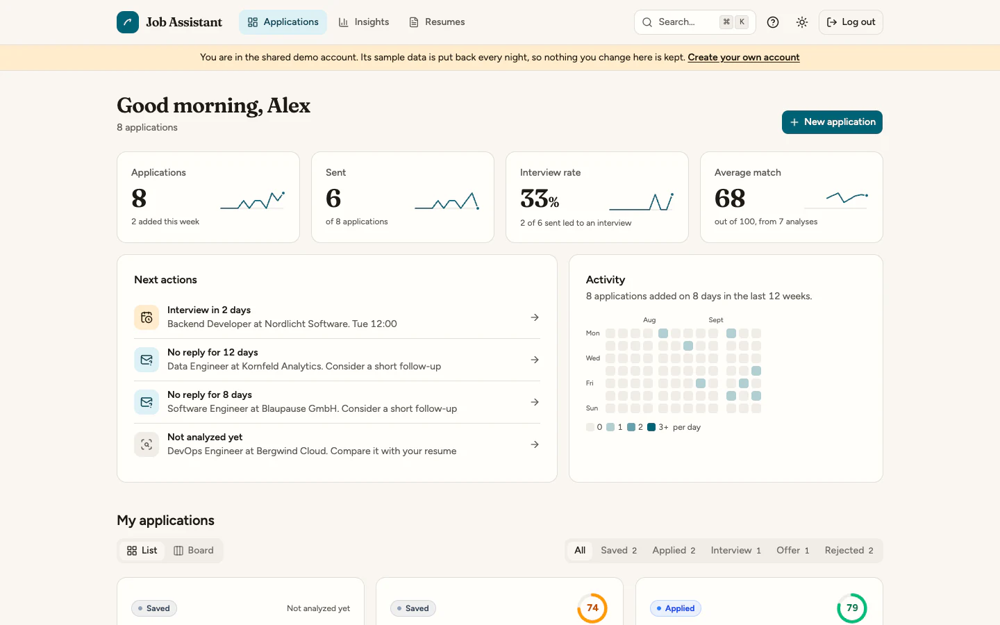
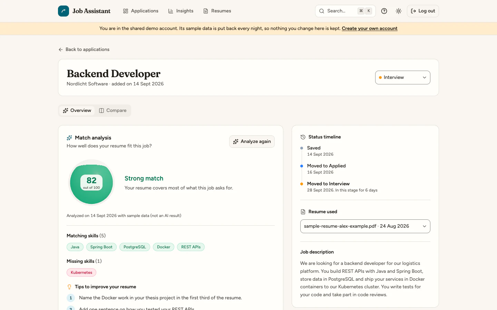
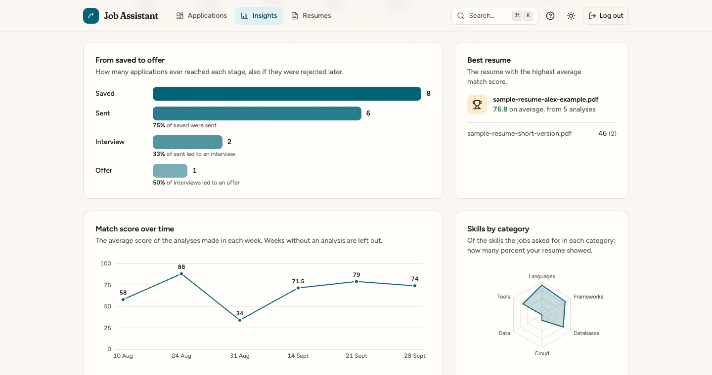
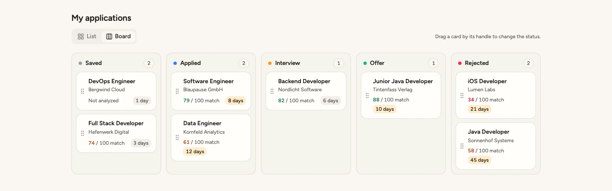
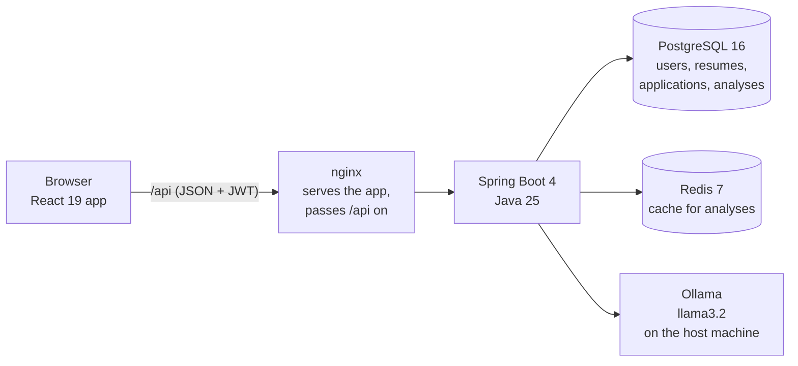
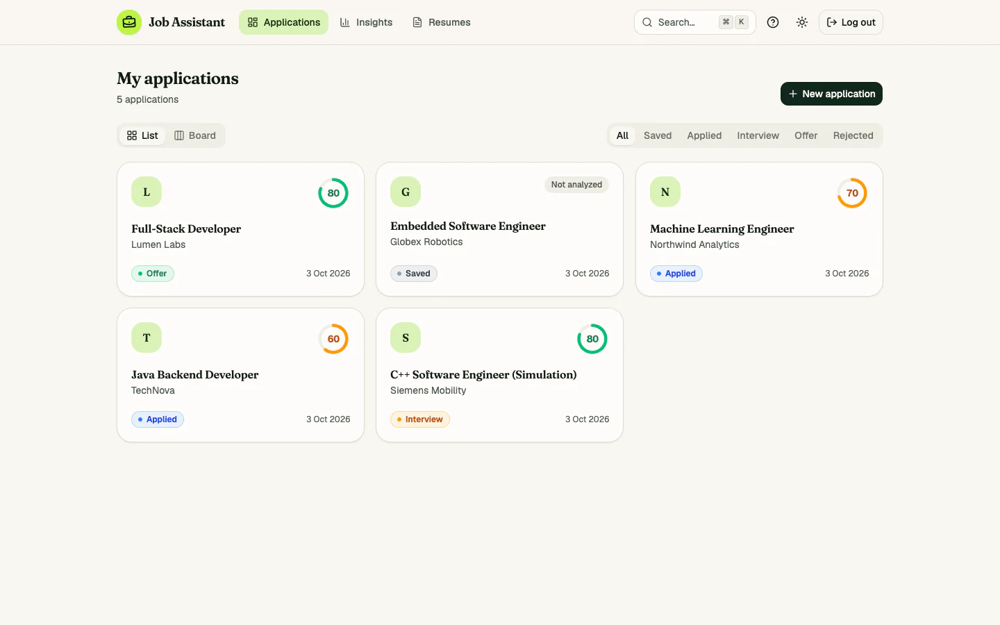
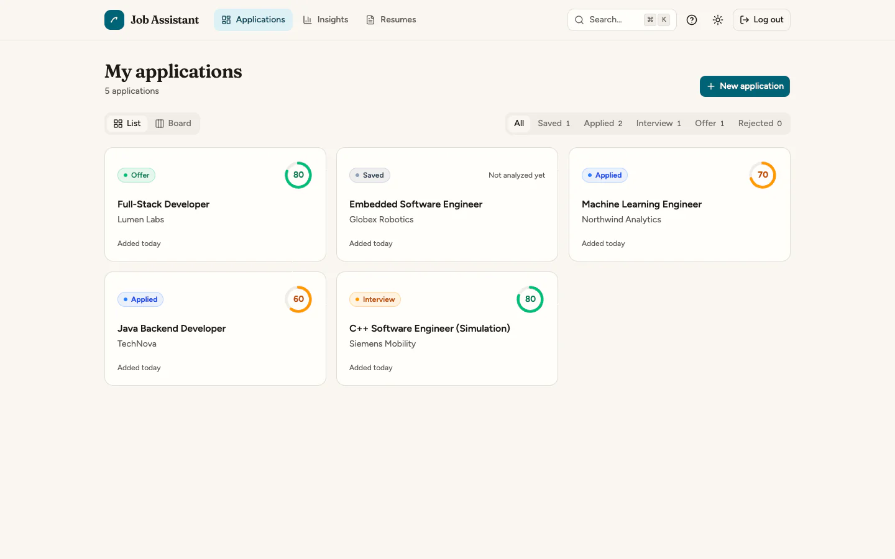

# Job Assistant

**Know where you stand before you apply.** Job Assistant compares your resume with a job posting on a local AI model, shows the skills you have and the ones you are missing, drafts the cover letter, and keeps every application in one place.

[](https://github.com/Jatin1Mathur/job-application-assistant/actions/workflows/ci.yml)


[](LICENSE)



## Why I built this

I am an M.Sc. Software Engineering student, and I apply to many jobs at the same time. Before sending an application I wanted an honest answer to one question: how well does my resume fit this posting, and what is missing? I built Job Assistant to answer that first and to keep every application, resume and cover letter in one place. It was also my chance to build one complete product from the database to the deployment, with an AI model that runs on my own machine instead of a cloud service.

## Screenshots

| Dashboard: numbers with their trend, next actions, activity | Analysis: match score, matching and missing skills, tips |
|---|---|
|  |  |
| **Insights**: funnel, best resume, score over time, skills by category | **Board**: drag and drop between statuses, days in each stage |
|  |  |

The screenshots show the demo account, which contains made-up sample data.

## Features

**AI (local model, through Ollama)**
- Match analysis: a score from 0 to 100, matching skills, missing skills and three tips for the resume
- Cover letter drafted only from facts in the resume, in three tones (formal, friendly, short), with regenerate and PDF export
- Compare view: resume and job description side by side, with the skills from the analysis marked
- Repeated analyses are answered from a Redis cache instead of asking the model again

**Job tracking**
- Applications as a card list or a Kanban board with drag and drop
- Status timeline: every status change is recorded with its date
- Notes and an interview date on each application
- Resumes with a preview of the first page, the skills found in the text, and a side-by-side comparison of two resumes
- Command palette (`Cmd+K` / `Ctrl+K`) and keyboard shortcuts

**Insights**
- Dashboard: applications, sent, interview rate and average match, each with its last twelve weeks
- Next actions: an interview in the next three days, no reply for more than seven days, not analyzed yet
- Funnel from saved to offer with conversion rates, match score over time, skills by category, best resume
- Only real data: a value that cannot be calculated yet is replaced by a sentence, not by 0

**Design and 3D**
- An original design system ([DESIGN.md](DESIGN.md)): warm paper, ink, one teal accent, light and dark mode
- Landing page with a 3D backpack built in code and a scroll story through the three steps
- A 3D compass on the login page that turns north on a successful login, a score orb, a skill universe
- Every 3D scene is loaded only where it is shown and has a flat fallback for reduced motion and for browsers without WebGL
- Keyboard friendly, 44 px touch targets, phone layout with a bottom tab bar

## Try the demo account

1. Start the app (see [Quick start](#quick-start-docker)) and open http://localhost:3000/login.
2. Click **Try with demo account**. No email and no password are needed.

You are then inside a shared account with two sample resumes, eight sample applications with a status history, notes and an interview date, and seven sample analyses. A few things to know:

- The sample analyses were written in advance, not produced by the app's AI model, and are labelled "sample data (not an AI result)". New analyses you start there are real AI results.
- The sample data is put back when the backend starts and every night at 03:00, so nothing you change is kept.
- The account has no password that anyone knows, and the database refuses to delete it or to change its email or password.
- On the landing page there is also a small "Try it now" demo that needs no account at all. It uses prepared sample results and says so.

## Architecture



- The **browser** only talks to nginx, so the backend needs no CORS settings.
- The **backend** checks the login token (JWT), reads the text of uploaded PDFs, stores the data and asks the AI model. Every row belongs to one user; another user's data is answered with "not found".
- **PostgreSQL** keeps the data. Flyway migrations create and change the tables.
- **Redis** remembers finished analyses for 24 hours. The key contains the resume, the application, the job description and the model name, so a changed text or a new model gets a fresh answer.
- **Ollama** runs the language model on the same machine. Resume text is not sent to a cloud AI service.

## Tech stack

| Area | Technology |
|---|---|
| Frontend | React 19, TypeScript 6, Vite 8, Tailwind CSS 4, shadcn/ui, Motion, Recharts, dnd-kit, three.js with React Three Fiber, pdf.js |
| Backend | Java 25, Spring Boot 4.1, Spring Security (OAuth2 resource server, JWT, BCrypt), Spring Data JPA, Bean Validation, PDFBox 3 |
| Data | PostgreSQL 16 with Flyway migrations, Redis 7 |
| AI | Ollama with `llama3.2`, called over HTTP (JSON mode for the analysis) |
| DevOps | Docker (multi-stage images, non-root), Docker Compose with health checks, nginx, GitHub Actions |
| Testing | JUnit 5, Mockito, Spring MockMvc, integration tests against a real PostgreSQL and Redis, Playwright for browser checks, oxlint |

## Quick start (Docker)

You need Docker (Docker Desktop on a Mac) and Ollama with the `llama3.2` model. Ollama runs on your own machine, not in Docker; it is only needed for the AI requests.

1. Copy `.env.example` to `.env` and set your own values (only the first time).
2. Start everything with one command, from the project folder:
   ```
   docker compose up --build
   ```
3. Open http://localhost:3000 in your browser.

Stop it with `Ctrl+C`, or with `docker compose down` from a second terminal. Your data stays in a Docker volume and is there again at the next start. Add `-d` (`docker compose up --build -d`) to run it in the background.

What the command starts:

| Container | Address | What it is |
|---|---|---|
| frontend | http://localhost:3000 | nginx with the built React app; passes every `/api` call on to the backend |
| backend | http://localhost:8080 | Spring Boot (for Postman) |
| postgres | localhost:5432 | Database |
| redis | localhost:6380 | Cache |

The backend starts only after the database and the cache answer their health checks, and the frontend starts only after the backend is healthy. The backend reaches Ollama on your machine through `host.docker.internal`.

### How the images are built (multi-stage build)

Both `Dockerfile`s have two stages. The first stage has all the tools needed to build: the JDK and Maven for the backend, Node.js for the frontend. The second stage starts from a small image and copies in only the finished result: the jar file, or the built HTML, CSS and JavaScript files. The tools and the source code stay behind in the first stage and are not part of the image that runs. That makes the final images small (backend: 448 MB instead of the 1.09 GB of its build stage; frontend: 87 MB instead of 1.34 GB) and leaves less inside them that could be attacked. Both run as a normal user, not as root.

### Continuous integration (CI)

On every push and every pull request, GitHub Actions runs `.github/workflows/ci.yml` on a fresh machine:

- **Backend tests**: `./mvnw test`, with a real PostgreSQL and Redis started next to the job
- **Frontend build and lint**: `npm ci`, `npm run lint`, `npm run build`
- **Docker images**: builds both images, to prove the Dockerfiles work

The badge at the top of this file shows the result for `main`.

## Development setup

For working on the code it is quicker to run the backend and the frontend directly, so changes show up at once. Docker then only runs the database and the cache.

1. Start the database and the cache:
   ```
   docker compose up -d postgres redis
   ```
2. Start the backend (http://localhost:8080):
   ```
   ./mvnw spring-boot:run
   ```
3. In a second terminal, start the frontend:
   ```
   cd frontend
   npm install   # only the first time
   npm run dev
   ```
4. Open http://localhost:5173 in your browser.

If the whole app is already running in Docker, stop its backend and frontend first (`docker compose stop backend frontend`), because the backend uses the same port 8080.

The frontend is a React + Vite + TypeScript app with Tailwind CSS in the `frontend` folder. It uses shadcn/ui components, Motion for animations, lucide icons and sonner toasts, and has a light and a dark mode. It needs Node.js 20.19 or newer. The dev server passes every `/api` call on to the backend on port 8080 (see `frontend/vite.config.ts`), so the backend needs no CORS settings.

## Engineering highlights

- **214 backend tests** run on every push in CI, against a real PostgreSQL and Redis. They include integration tests for the demo account and its database trigger.
- **145 scripted browser checks** (Playwright) cover the whole flow: sign-up, upload, AI analysis, cover letter, drag and drop, keyboard use, reduced motion, phone width and the demo account. They were run during development, the last time against the Docker build. The script is not part of the repository or of CI yet.
- **Cache speed-up:** in one measured run with `llama3.2`, the first analysis took 3.66 s and the same request again took 0.01 s from Redis (`X-Cache: MISS`, then `HIT`).
- **Contrast is computed, not guessed:** all 46 colour pairs used for text and controls were checked. Text pairs pass 4.5:1, control borders and focus rings pass 3:1, in light and dark mode.
- **3D that stays fast:** the 3D code (about 909 kB) is downloaded only on pages that show a scene, the pixel ratio is capped at 1.5 (1.25 on phones), rendering stops when a scene is off-screen or the tab is hidden, and phones get a lighter backpack (6,888 instead of 11,656 triangles). The scroll story holds about 60 frames per second on a MacBook Air (M4).
- **Two bugs that only Docker showed**, both found by running the full flow against the containers and both fixed:
  - nginx served the pdf.js worker (`.mjs`) as an unknown file type, so resume previews stayed empty.
  - The frontend health check asked `localhost`, which resolved to an address nginx did not listen on, so a working container was reported as unhealthy.
- **Small images:** 448 MB for the backend and 87 MB for the frontend, because the build tools stay in the first stage.
- **Security basics:** passwords are stored as BCrypt hashes, secrets come from `.env`, the login error does not reveal whether an email exists, and both containers run as a normal user.

## Design

The design system is written down in [DESIGN.md](DESIGN.md): colours, typography, spacing, components, and do's and don'ts. [docs/design-decisions.md](docs/design-decisions.md) explains the audit, every change with its UX reason, the trade-offs, and what has not been done.

The dashboard list before and after the redesign:

| Before | After |
|---|---|
|  |  |

More before and after pictures of every page, in desktop and phone size and in light and dark mode, are in [docs/screenshots](docs/screenshots). They are WebP files, which keeps the repository small.

## How I built it

I built this project step by step, with [Claude Code](https://claude.com/claude-code) as an AI pair programmer. To be clear about who did what:

- **My part:** I planned each step and wrote down what it should do. I reviewed every pull request before merging it, tested the features myself in the running app, and made the product and design decisions: what the app should do, what it should look like, and what to leave out.
- **Claude Code's part:** it wrote most of the code, the tests and the first drafts of the documentation from my instructions, ran the tests, and opened the pull requests. Where it made a choice of its own, it said so in the pull request, and I decided whether to keep it.

Each step is one pull request, so the history shows how the project grew: database and resume upload, the job tracker, the AI analysis and cover letter, validation and caching, login with JWT, the React frontend, the design system, the 3D scenes, and Docker with continuous integration.

## What I learned

- **"It works on my machine" is not the end.** Two bugs appeared only when the app ran in Docker. Running the whole flow against the real setup found them before anyone else did.
- **Tests need the real thing sometimes.** Mocks are fast, but the rule that the demo user cannot be deleted lives in the database, so it is tested against a real PostgreSQL.
- **Good design is mostly saying no.** One accent colour, few type styles and written rules made the app calmer than any added effect did.
- **An AI pair programmer is fast, but the judgement stays with me.** Clear step descriptions, small pull requests and reading every change mattered more than the speed of writing code.
- **Honesty is a feature.** Sample data is labelled, numbers that cannot be calculated are not shown as 0, and the cover letter prompt forbids inventing experience. A small local model still makes mistakes, so the app tells users to check its output.

## Roadmap

- Cloud deployment with a hosted AI model, so the app can be tried without installing anything
- Email reminders for follow-ups and interviews
- A browser extension that imports a job posting from the page you are reading

## API and Postman

<details>
<summary>Endpoints added in the last steps, and the Postman collection</summary>

| Request | What it does |
|---|---|
| `GET /api/dashboard?zone=Europe/Berlin` | Counts, interview rate, average score, applications per day and per week for the last 12 weeks, and next actions |
| `GET /api/insights?zone=...` | Now also: funnel, score per week, skills by category, score per resume |
| `PATCH /api/applications/{id}/details` | Notes and interview date (`{"notes": "...", "interviewAt": "2026-10-06T09:00:00Z"}`) |
| `POST /api/applications/{id}/cover-letter?resumeId=1&tone=friendly` | Tone is `formal` (default), `friendly` or `short` |
| `GET /api/applications/{id}/cover-letter.pdf` | The stored cover letter as a PDF |
| `GET /api/resumes/{id}/file` | The uploaded PDF |
| `GET /api/account`, `PATCH /api/account` | Email and the optional name (`{"name": "Jatin"}`) |

`GET /api/applications/{id}` now includes `statusHistory`, `notes`, `interviewAt`, `statusChangedAt` and `coverLetterTone`. Registration accepts an optional `name`.

### Testing with Postman

A ready-made collection is in [`postman/Job-Application-Assistant.postman_collection.json`](postman/Job-Application-Assistant.postman_collection.json).

1. In Postman choose **Import** and select that file.
2. Run the requests in this order the first time:
   1. **Auth → Register** (change the email and password in the body first)
   2. **Auth → Login** (same email and password)
   3. **Resumes → Upload resume** (pick your PDF in the Body tab)
   4. **Applications → Create application**
3. After that, every other request works in any order.

You do not need to copy anything by hand. Login saves the `token`, Upload resume saves `resumeId`, and Create application saves `applicationId` as collection variables, and the other requests use them. The token is sent automatically as a Bearer token on every request except Health, Register and Login.

The token is valid for 24 hours. If you get a 401, run **Login** again. If the app runs somewhere else, change the `baseUrl` collection variable.

</details>

## Author

**Jatin Mathur**, M.Sc. Software Engineering student

- GitHub: [Jatin1Mathur](https://github.com/Jatin1Mathur)
- LinkedIn: [jatin-mathur-b04b122b](https://www.linkedin.com/in/jatin-mathur-b04b122b)

## License

[MIT](LICENSE)
