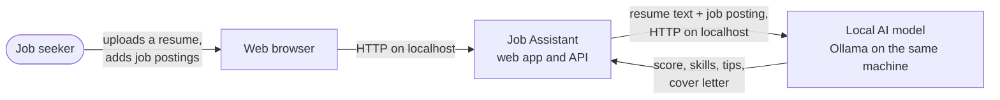
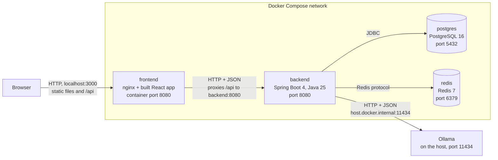
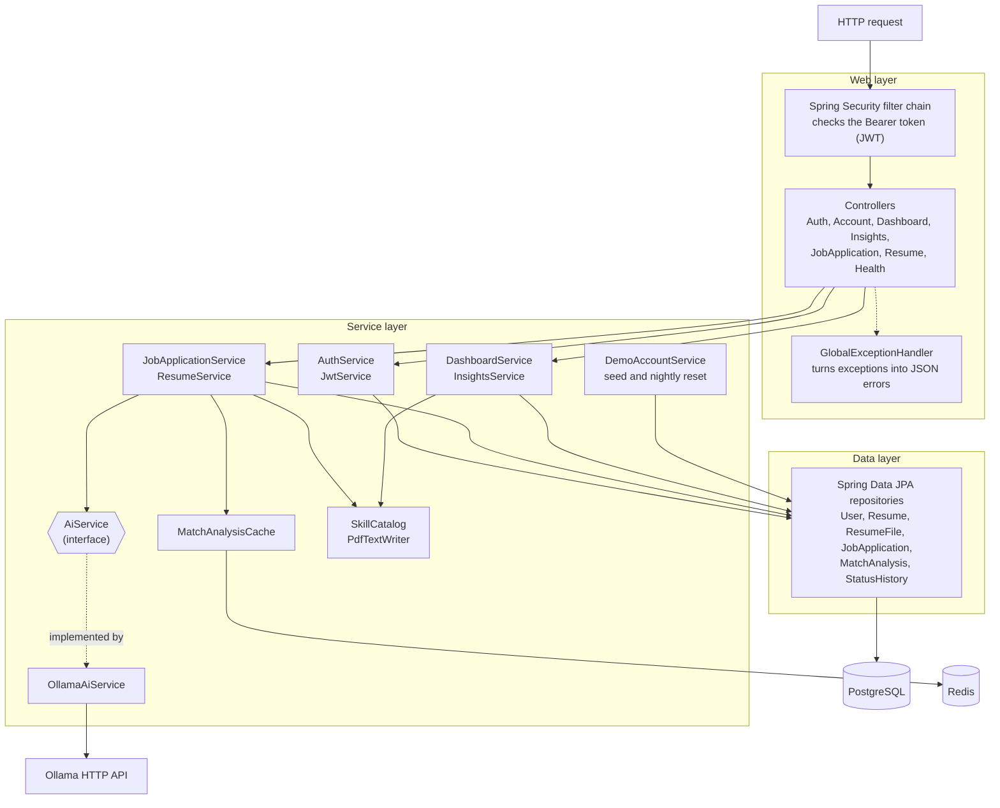
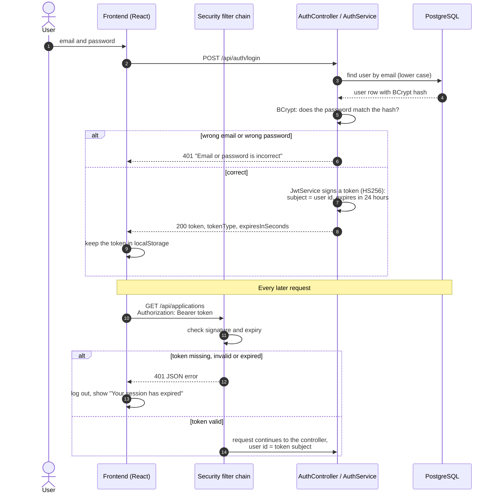
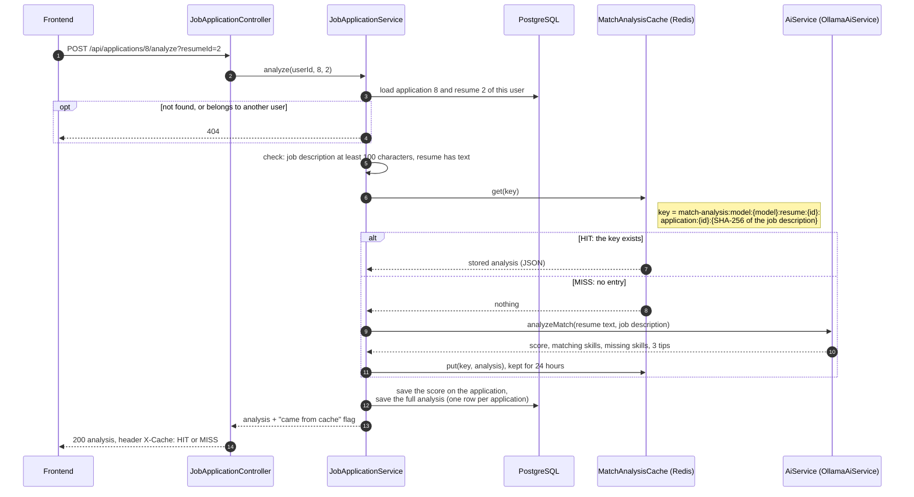
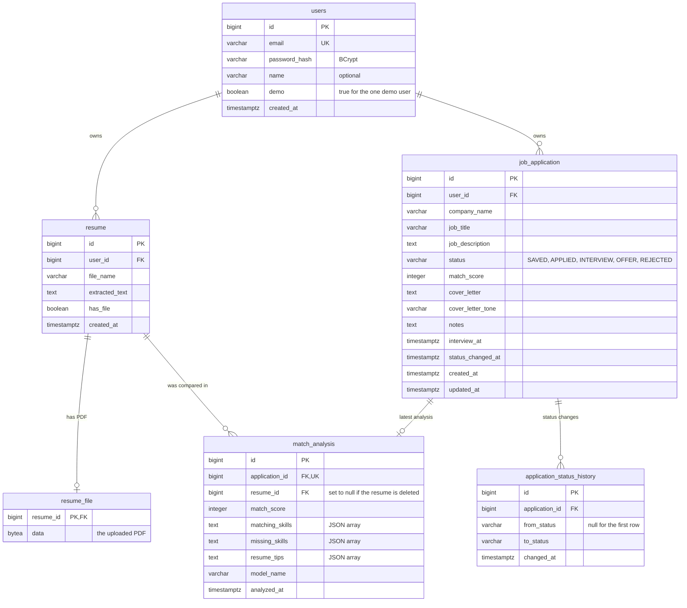
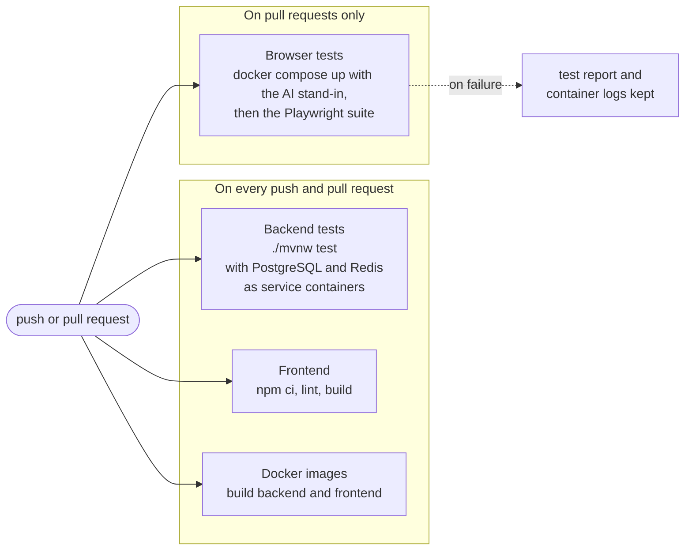
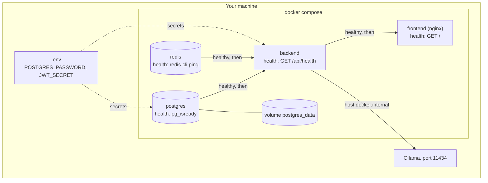
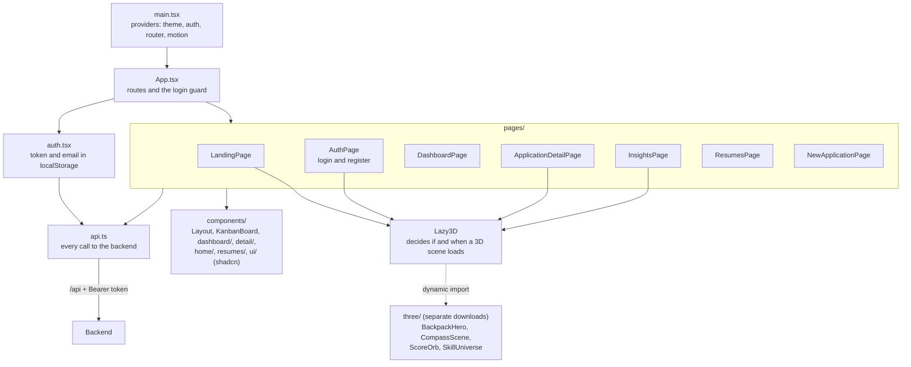

# Architecture

This document describes how Job Assistant is built: the parts of the system, how a request travels through them, the data model, the API, security, testing and deployment. It is written for engineers who want to understand or review the project. The short version is in the [README](../README.md); the reasons behind the main decisions are in the [decision records](adr/).

Everything here describes the code as it is in this repository. Where something is a limitation, it is listed under [Known limitations](#known-limitations).

## Contents

1. [System context](#1-system-context)
2. [Containers](#2-containers)
3. [Backend layers](#3-backend-layers)
4. [Login and JWT authentication](#4-login-and-jwt-authentication)
5. [Analyze match and the Redis cache](#5-analyze-match-and-the-redis-cache)
6. [Database](#6-database)
7. [API reference](#7-api-reference)
8. [Security model](#8-security-model)
9. [Testing strategy](#9-testing-strategy)
10. [CI pipeline](#10-ci-pipeline)
11. [Deployment with Docker Compose](#11-deployment-with-docker-compose)
12. [Frontend architecture](#12-frontend-architecture)
13. [Performance notes](#13-performance-notes)
14. [Known limitations](#known-limitations)

## 1. System context

Who uses the system and what it talks to.

There is no other outside system. The app sends no email, calls no cloud service, and the AI model runs on the user's own machine, so resume text does not leave it.

## 2. Containers

The parts that run, with their ports and the protocol on each connection. Port numbers are the ones in `docker-compose.yml`.

| Container | Image | Host port | Role |
|---|---|---|---|
| frontend | `nginxinc/nginx-unprivileged` with the built React app | 3000 | Serves the static files and passes every `/api` request on to the backend. The browser never talks to the backend directly, so the backend needs no CORS settings. |
| backend | Java 25 JRE (Alpine) with the Spring Boot jar | 8080 | The REST API. Also reachable directly, for Postman. |
| postgres | `pgvector/pgvector:pg16` | 5432 | All persistent data. |
| redis | `redis:7` | 6380 | Cache for AI match results. The host port is 6380 so it does not clash with another Redis on 6379. |
| Ollama | not a container | 11434 | Runs `llama3.2` on the host. The backend reaches it through `host.docker.internal`. |

In development the frontend container is replaced by the Vite dev server on port 5173, which proxies `/api` in the same way.

## 3. Backend layers

The backend is a layered Spring Boot application in the package `com.jatin.jobassistant`.

- **Controllers** only translate between HTTP and method calls. They read the user id from the token (`CurrentUser.id(jwt)`) and pass it to the service.
- **Services** hold the rules. Every method that touches user data takes the user id and loads rows with it, for example `findByIdAndUserId`.
- **`AiService`** is an interface with three methods: `modelName()`, `analyzeMatch(...)` and `generateCoverLetter(...)`. `OllamaAiService` is the only implementation today. The rest of the code depends on the interface only, so another provider can be added as a second implementation ([ADR 001](adr/001-local-ai-with-ollama.md)).
- **`GlobalExceptionHandler`** maps exceptions to one JSON shape: `{"status": 404, "error": "Not Found", "message": "..."}`.
- **Flyway** creates and changes the tables; Hibernate only checks that the tables match the entities (`ddl-auto: validate`).

## 4. Login and JWT authentication

Notes:

- There is no server-side session. The token is the only proof of login, so the backend is stateless.
- The same message is returned for an unknown email and a wrong password, so the login form cannot be used to find out which emails have an account.
- "Try with demo account" uses `POST /api/auth/demo`, which returns a token for the demo user without any password. A password login for the demo user is always refused.

## 5. Analyze match and the Redis cache

`POST /api/applications/{id}/analyze?resumeId={resumeId}`

Notes:

- The key contains the model name and a hash of the job description. A changed description or a different model therefore gets a fresh answer, and an old answer is never returned for new text ([ADR 002](adr/002-redis-cache-for-ai-results.md)).
- If Redis is down, the cache methods log a warning and behave like a MISS. The analysis still works, only slower.
- An AI error is never cached: `put` is only reached after a valid answer.
- Cover letters are not cached. "Regenerate" is meant to give new wording, so they are generated with a temperature of 0.6, while the analysis uses 0.
- If the AI is not running the answer is 503; if it takes longer than 180 seconds, 504; if its answer cannot be used, 502.

## 6. Database

The tables as the six Flyway migrations (`src/main/resources/db/migration`, `V1` to `V6`) leave them.

| Migration | What it does |
|---|---|
| `V1` | `resume` table |
| `V2` | `job_application` table with a check constraint on `status` |
| `V3` | `users` table; `user_id` on resumes and applications with `ON DELETE CASCADE` |
| `V4` | `match_analysis` table, one row per application |
| `V5` | `demo` flag on users, a unique index that allows only one demo user, and a trigger that protects it |
| `V6` | `name` on users; notes, interview date, tone and `status_changed_at` on applications; `application_status_history`; `resume_file` |

Design points:

- Deleting a user deletes their resumes and applications; deleting an application deletes its analysis and its history (`ON DELETE CASCADE`).
- The uploaded PDF is in its own table, so listing resumes never loads the files.
- `status_changed_at` repeats the date of the last history row on the application itself. The board shows "days in this stage" for every card, and this avoids one history query per card.
- The image is `pgvector/pgvector`, which is PostgreSQL 16 with the vector extension available. No vector column is used today.

## 7. API reference

All paths start with `/api`. "Token" means the header `Authorization: Bearer <token>` is required; without it the answer is 401. Errors have the shape `{"status", "error", "message"}`.

| Method | Path | Auth | Purpose |
|---|---|---|---|
| GET | `/health` | public | Answers `OK`. Used by the Docker health check. |
| POST | `/auth/register` | public | Creates an account (`email`, `password`, optional `name`). 201, or 409 if the email is taken. |
| POST | `/auth/login` | public | Returns a token. 401 with a generic message on failure. |
| POST | `/auth/demo` | public | Returns a token for the shared demo account. 503 if the demo account is switched off. |
| GET | `/account` | token | Email, name and whether this is the demo account. |
| PATCH | `/account` | token | Sets or removes the name. 403 for the demo account. |
| GET | `/dashboard?zone=` | token | Counts, interview rate, average score, applications per day and per week for 12 weeks, next actions. |
| GET | `/insights?zone=` | token | Counts per status, average score, most-missed skills, funnel, score per week, skills by category, score per resume. |
| POST | `/resumes` | token | Uploads a PDF (multipart field `file`, up to 5 MB). 201. |
| GET | `/resumes` | token | The user's resumes with a text preview and the skills found in the text. |
| GET | `/resumes/{id}` | token | One resume with its full extracted text. |
| GET | `/resumes/{id}/file` | token | The uploaded PDF. |
| POST | `/applications` | token | Creates an application (`companyName`, `jobTitle`, `jobDescription` of at least 100 characters). 201. |
| GET | `/applications?status=&page=&size=` | token | A page of applications, newest first, optionally one status. |
| GET | `/applications/{id}` | token | One application with its analysis and status history. |
| PATCH | `/applications/{id}/status` | token | Changes the status and records the change. |
| PATCH | `/applications/{id}/details` | token | Notes and interview date. |
| POST | `/applications/{id}/analyze?resumeId=` | token | Runs the AI match analysis. Header `X-Cache: HIT` or `MISS`. |
| POST | `/applications/{id}/cover-letter?resumeId=&tone=` | token | Writes a cover letter. `tone` is `formal` (default), `friendly` or `short`. |
| GET | `/applications/{id}/cover-letter.pdf` | token | The stored cover letter as a PDF download. |
| DELETE | `/applications/{id}` | token | Deletes the application. 204. |

Common error answers: 400 for invalid input, 401 without a valid token, 404 for something that does not exist or belongs to another user, 413 for an upload over 5 MB, 502/503/504 for problems with the AI model.

A Postman collection with these requests is in [`postman/`](../postman).

## 8. Security model

| Topic | What the code does |
|---|---|
| **Passwords** | Stored only as BCrypt hashes. BCrypt reads at most 72 bytes, so passwords are limited to 8 to 72 characters. Request objects hide the password in `toString()`, so it cannot end up in a log. |
| **Login tokens** | JWT signed with HS256, valid for 24 hours, user id in the subject. Checked by Spring Security's OAuth2 resource server on every request. |
| **The signing secret** | Read from the environment (`JWT_SECRET`). The application refuses to start if it is shorter than 32 characters. |
| **No sessions** | The API is stateless and uses no cookies, so CSRF protection is switched off on purpose. |
| **Data isolation** | Every query for user data includes the user id from the token. A row of another user is answered with 404, the same as a row that does not exist, so ids cannot be probed. |
| **Login error** | One message for an unknown email and a wrong password. |
| **Uploads** | Only PDFs: the file name and the first bytes (`%PDF-`) are both checked, and the size limit is 5 MB. |
| **Input validation** | Bean Validation on request bodies and parameters, with readable messages. |
| **Demo account** | No known password; entered only through `/auth/demo`. A database trigger refuses to delete the demo user or to change its email, password or demo flag. Its name cannot be changed through the API. Its data is reset at start-up and every night. |
| **Secrets** | `POSTGRES_PASSWORD` and `JWT_SECRET` come from `.env`, which is in `.gitignore`. `docker-compose.yml` refuses to start without them. CI uses throwaway values that exist only for that run. |
| **Containers** | Both app containers run as a normal user, not root. |
| **AI prompts** | The cover letter prompt forbids inventing facts, and the length of the answer is checked in code, because a model can ignore instructions. |

What is not covered is listed under [Known limitations](#known-limitations).

## 9. Testing strategy

Three levels, from fast and narrow to slow and complete.

| Level | Tools | Count | What it proves |
|---|---|---|---|
| **Unit tests** | JUnit 5, Mockito | 139 tests in 11 classes | The rules of each service in isolation: scores, the funnel, next actions, the cache key, PDF writing, skill detection. Repositories and the AI are mocks. `OllamaAiService` is tested against a fake HTTP server (`MockRestServiceServer`). |
| **Web layer tests** | `@WebMvcTest`, MockMvc, the real `SecurityConfig` | 68 tests in 6 classes | Status codes, JSON shapes, validation messages, and that every endpoint except the public ones needs a token. Services are mocks. |
| **Integration tests** | `@SpringBootTest` against a real PostgreSQL and Redis | 7 tests in 2 classes | That the application starts, the Flyway migrations run, the demo account is seeded, and the database trigger really refuses to delete or change the demo user. |
| **End-to-end tests** | Playwright ([`e2e/`](../e2e)) | 21 tests with 145 checks | The whole product in a real browser against the Docker setup: sign-up, upload, analysis, cover letter, board, insights, keyboard, phone width, reduced motion, demo account. |

All 214 backend tests run with `./mvnw test`.

**About the integration tests:** they do not use Testcontainers. They connect to the PostgreSQL and Redis that are already running: the Docker Compose containers on a developer's machine, and service containers in CI. This keeps the setup simple, but it means the tests need those two containers to be up, and locally they run against the development database (they reset the demo account's data). Moving them to Testcontainers would remove both drawbacks.

**What is replaced in CI, and why:** the CI machine has no AI model. For the end-to-end tests, `e2e/mock-ollama.mjs` stands in for Ollama and answers with fixed text. Only the model is replaced: the backend still builds the prompt, validates the answer, stores it and caches it, and PostgreSQL, Redis, nginx and the frontend are the real containers. These tests therefore do not measure the quality of the real model's answers. The same suite can be run locally against the real model (see [`e2e/README.md`](../e2e/README.md)).

## 10. CI pipeline

`.github/workflows/ci.yml` runs on every push and every pull request.

The jobs run in parallel and do not depend on each other. The images are built to prove the Dockerfiles work; they are not pushed to a registry, and there is no automatic deployment (see [Known limitations](#known-limitations)).

## 11. Deployment with Docker Compose

`docker compose up --build` builds the two images and starts four containers in an order enforced by health checks.

- **Start order:** the backend starts only when PostgreSQL and Redis answer their health checks, and the frontend only when the backend is healthy. "Container exists" is not enough: a database needs a few seconds before it accepts connections.
- **Images:** both Dockerfiles have two stages. The first has the build tools (JDK and Maven, or Node.js); the second copies only the result into a small image. Backend: 448 MB instead of the 1.09 GB of its build stage. Frontend: 87 MB instead of 1.34 GB.
- **Data:** PostgreSQL keeps its files in a named volume, so data survives `docker compose down`. Redis keeps nothing permanently; it is only a cache.
- **Configuration:** the backend reads its addresses from environment variables (`DB_HOST`, `REDIS_HOST`, `OLLAMA_BASE_URL`) with defaults that fit a start outside Docker.
- **nginx** looks up the address of the backend again after a backend restart (it uses Docker's name server as resolver). Without that it would keep sending requests to the old address.

Reasons for this setup: [ADR 006](adr/006-docker-compose-for-one-command-setup.md).

## 12. Frontend architecture

A single-page React 19 application in `frontend/src`, built with Vite and TypeScript.

- **Routing:** `/` is the public landing page; `/login` and `/register` share one `AuthPage`; everything else needs a token and is wrapped in `Layout` (navigation, command palette, shortcuts).
- **`api.ts`** is the only place that calls `fetch`. It adds the token, turns backend errors into one `ApiError` type with the backend's own message, and reports a 401 so the app can log the user out.
- **`auth.tsx`** keeps the token and the email in a React context and in `localStorage`, so a reload keeps the user logged in.
- **State:** component state and context only. There is no global store; each page loads what it needs.
- **3D:** every scene is a lazy import behind `Lazy3D`. `Lazy3D` shows a flat fallback first and loads the scene only if WebGL is available, the user has not asked for reduced motion, and the scene has come near the screen. It stops rendering when the scene is off-screen or the tab is hidden ([ADR 005](adr/005-3d-only-on-selected-pages.md)).
- **pdf.js** is loaded only on the resumes page, when the first thumbnail is drawn.
- **Design:** Tailwind CSS 4 with tokens from [DESIGN.md](../DESIGN.md), shadcn/ui components, Motion for animation. All animation respects the "reduce motion" setting.

## 13. Performance notes

| Topic | Measurement or decision |
|---|---|
| **AI cache** | In one measured run with `llama3.2`, the first analysis took 3.66 s and the same request again took 0.01 s from Redis. |
| **List queries** | The analyses of a whole page of applications are loaded with one query, not one per application. |
| **Resume files** | Stored in a separate table, so listing resumes does not load PDFs. The file endpoint lets the browser cache the PDF for 30 days. |
| **3D code** | About 909 kB (241 kB compressed) of shared 3D code plus a few kB per scene, downloaded only on pages that show a scene. The dashboard downloads none of it. |
| **Pixel ratio** | Capped at 1.5 (1.25 on phones), so dense screens do not render four times the pixels. |
| **Backpack model** | 11,656 triangles on desktop, 6,888 on phones, one instanced mesh for the stitches, no real-time shadows. |
| **Frame rate** | The scroll story on the landing page measured about 59 to 60 frames per second on a MacBook Air (M4) in Chrome. Not measured on a real phone. |
| **pdf.js** | 431 kB plus a 1.26 MB worker file, downloaded only on the resumes page. |
| **Static files** | nginx sends hashed asset files with a one-year cache header and compresses text files. |

## Known limitations

- **Main bundle size.** The main JavaScript bundle is about 1.2 MB (370 kB compressed). The pages are not split into separate downloads; only the 3D scenes and pdf.js are.
- **The model is small and local.** `llama3.2` can miss skills or misjudge a match. The app tells users to check the result, and skills are labelled as coming from the AI.
- **Skill detection in resumes** is a search for about 80 well-known names. It misses skills written in other words and can mistake an ordinary word for a skill.
- **Dashboard and insights load all of a user's applications** into memory and count in Java. Fine for hundreds of applications, not designed for many thousands.
- **Token storage.** The token is in `localStorage`, which a script injected into the page could read. There are no refresh tokens: after 24 hours the user logs in again. A token cannot be revoked before it expires.
- **No rate limiting** on login or on the AI endpoints.
- **No HTTPS** in the local setup, and no production deployment. The images are built in CI but not published.
- **The demo account is shared.** Two visitors at the same time see each other's changes until the nightly reset.
- **Integration tests use the running database** instead of Testcontainers (see [Testing strategy](#9-testing-strategy)).
- **Older data.** Applications created before the status history existed have only "created" and their current status; resumes uploaded before files were stored have no preview.
